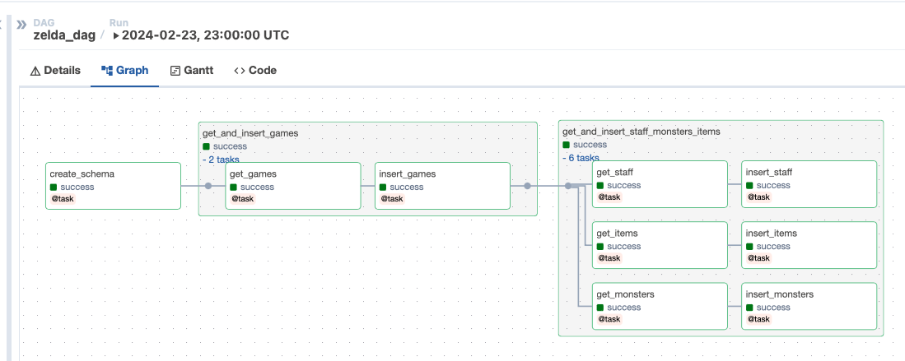
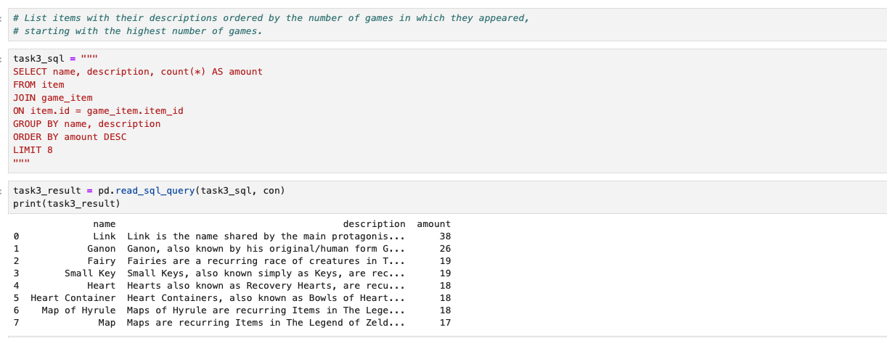
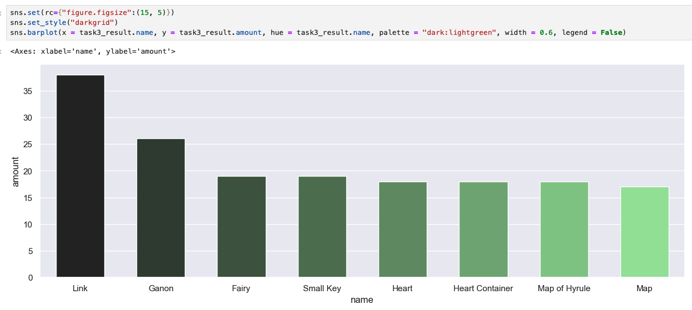

# Zelda API ETL workflow

This is a basic ETL workflow using Airflow and JupyterLab to extract data from the Zelda API, transform it and load it
into a SQLite database to finally solve several SQL tasks using a notebook in JupyterLab.

## Setup notes

It is recommended to use a virtual environment for this project. The following chapter describes how to install the
basic requirements as well as Airflow and JupyterLab.

* Python version: 3.11.x
* Airflow version: 2.8.1

Documentation: https://airflow.apache.org/docs/apache-airflow/stable/start.html

### Basic requirements

Install the following dependencies in your virtual environment:

```sh
pip install pandas
pip install matplotlib
pip install requests
pip install seaborn
```

Note: Because of limited time, this was done pragmatically. In the future, adding a `requirements.txt` file or
using https://python-poetry.org/ for dependency management would be better.

### Install Airflow using project as home directory
```sh
export AIRFLOW_HOME=$(pwd)/airflow
AIRFLOW_VERSION=2.8.1
PYTHON_VERSION="$(python --version | cut -d " " -f 2 | cut -d "." -f 1-2)"
CONSTRAINT_URL="https://raw.githubusercontent.com/apache/airflow/constraints-${AIRFLOW_VERSION}/constraints-${PYTHON_VERSION}.txt"
pip install "apache-airflow==${AIRFLOW_VERSION}" --constraint "${CONSTRAINT_URL}"
```

### Run Airflow using project as home directory
```sh
NO_PROXY="*" AIRFLOW_HOME="$(pwd)/airflow" airflow standalone
```

After this, Airflow runs at http://localhost:8080/

Login credentials are shown in the log output from Airflow, e.g.:
```
standalone | Airflow is ready
standalone | Login with username: admin  password: asdf
```

Note: `NO_PROXY="*"` is required to make Airflow work with Mac and sending requests,
for more info, see: https://github.com/apache/airflow/discussions/24463

### Remove example content
When starting Airflow the first time in standalone mode, it will set up some folders and files
within the project folder (if `AIRFLOW_HOME` was set correctly).

To remove the example content / templates, change the `airflow/airflow.cfg` file and set the
value for `load_examples` to `False`.

The example content is created on the first run, to finally remove it, run the following command:
```sh
NO_PROXY="*" AIRFLOW_HOME="$(pwd)/airflow" airflow db reset
```

### Move DAGs folder to project level
By default, Airflow uses the `dags` folder within the `AIRFLOW_HOME` directory. However, to be able to
add the `AIRFLOW_HOME` directory to the `.gitignore` file, it is recommended to move the `dags` folder outside
the `AIRFLOW_HOME` directory.

To move the `dags` folder to project level, change the `airflow/airflow.cfg` file and set the  value
for `dags_folder` to `dags` on project level, example:
```
/Users/melissa/zelda-api/dags
```
### Complete Airflow workflow visualized as a graph

If all steps have been executed successfully, the zelda_dag should now be visible in the Airflow interface. As soon as 
it is switched on and running, you can control its workflow. The entire Airflow workflow is shown in the graph view. 
The dag including the various tasks and the order of execution is visualized here.



### Install JupyterLab
```sh
pip install jupyterlab
```

### Start JupyterLab and open task solutions
Start JupyterLab with the following command in the virtual environment:
```sh
jupyter lab
```
[JupyterLab](https://jupyter.org) is the latest web-based interactive development for notebooks, code and data.
The flexible interface helps us to execute various SQL queries.

### Sample JupyterLab application to execute SQL queries 



Documentation: https://docs.jupyter.org/en/latest/

### Visualization the results
[Seaborn](https://seaborn.pydata.org) is a Python data visualization library based on 
[matplotlib](https://matplotlib.org). It provides a high-level interface for drawing attractive and informative 
statistical graphics. In this example we used it to visualize our result. A bar chart has been created.



Documentation: https://seaborn.pydata.org/installing.html

The solutions for the tasks are located in the `zelda.ipynb` notebook.
